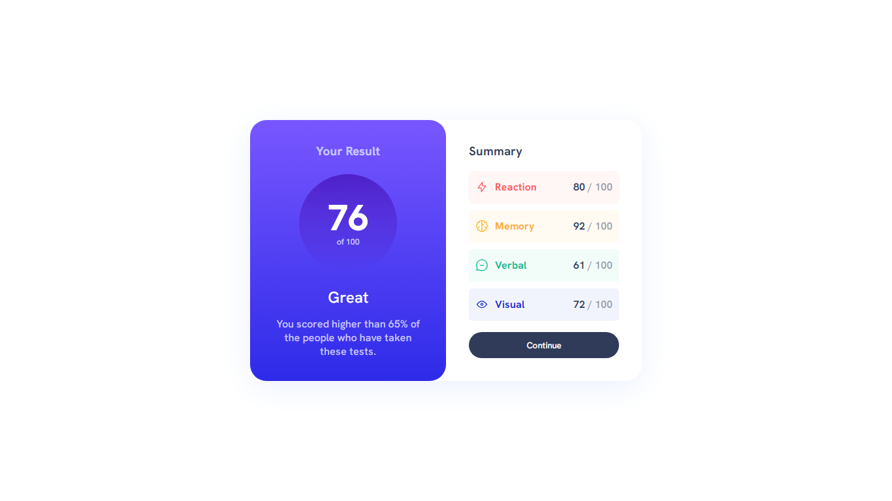

# Result Summary Component Challenge

This README.md file provides a summary of the "Result Summary Component" challenge from Frontend Mentor. I completed this challenge for the desktop version.

## Challenge Description

Frontend Mentor is a platform that provides coding challenges to help you improve your front-end development skills. The "Result Summary Component" challenge is one of these challenges. In this challenge, the goal is to create a responsive result summary component.

## My Solution

I have completed the challenge by building a responsive result summary component using HTML and CSS. Here are some key features of my solution:

* **Responsive Design:** The component is designed to work seamlessly on desktop screens.

* **Clean Code:** I have written clean and maintainable code, following best practices in HTML and CSS.

## Technologies Used

* **HTML**
* **CSS**

## Future Improvements

While I have completed the desktop version of the challenge, there is always room for improvement. Here are some potential future enhancements for this project:

* **Mobile Responsiveness:** Extend the design to be fully responsive for mobile and tablet devices.

## Feedback and Questions

If you have any feedback or questions about my solution to the "Result Summary Component" challenge, please feel free to reach out to me. Your feedback is valuable and will help me improve my skills.

Thank you for reviewing my project! ❤️

**Muhaideen Nausar**